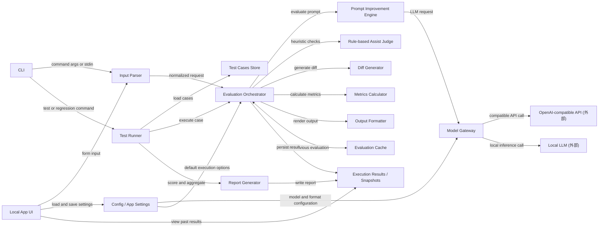

# ARCHITECTURE_DIAGRAM.md

```mermaid
flowchart LR
  CLI["CLI"]
  APP["Local App UI"]

  INPUT["Input Parser"]
  ORCHESTRATOR["Evaluation Orchestrator"]
  ENGINE["Prompt Improvement Engine"]
  RULES["Rule-based Assist Judge"]
  DIFF["Diff Generator"]
  METRICS["Metrics Calculator"]
  FORMATTER["Output Formatter"]
  TEST_RUNNER["Test Runner"]
  REPORTER["Report Generator"]
  MODEL_GATEWAY["Model Gateway"]

  CONFIG["Config / App Settings"]
  CASES["Test Cases Store"]
  RESULTS["Execution Results / Snapshots"]
  CACHE["Evaluation Cache"]

  OPENAI["OpenAI-compatible API (外部)"]
  LOCAL_LLM["Local LLM (外部)"]

  CLI -->|command args or stdin| INPUT
  APP -->|form input| INPUT
  APP -->|load and save settings| CONFIG
  APP -->|view past results| RESULTS

  CLI -->|test or regression command| TEST_RUNNER
  INPUT -->|normalized request| ORCHESTRATOR

  ORCHESTRATOR -->|evaluate prompt| ENGINE
  ORCHESTRATOR -->|heuristic checks| RULES
  ORCHESTRATOR -->|generate diff| DIFF
  ORCHESTRATOR -->|calculate metrics| METRICS
  ORCHESTRATOR -->|render output| FORMATTER
  ORCHESTRATOR <--> |reuse previous evaluation| CACHE
  ORCHESTRATOR -->|persist result| RESULTS

  ENGINE -->|LLM request| MODEL_GATEWAY
  MODEL_GATEWAY -->|compatible API call| OPENAI
  MODEL_GATEWAY -->|local inference call| LOCAL_LLM
  CONFIG -->|model and format configuration| MODEL_GATEWAY
  CONFIG -->|default execution options| ORCHESTRATOR

  TEST_RUNNER -->|load cases| CASES
  TEST_RUNNER -->|execute case| ORCHESTRATOR
  TEST_RUNNER -->|score and aggregate| REPORTER
  REPORTER -->|write report| RESULTS
```