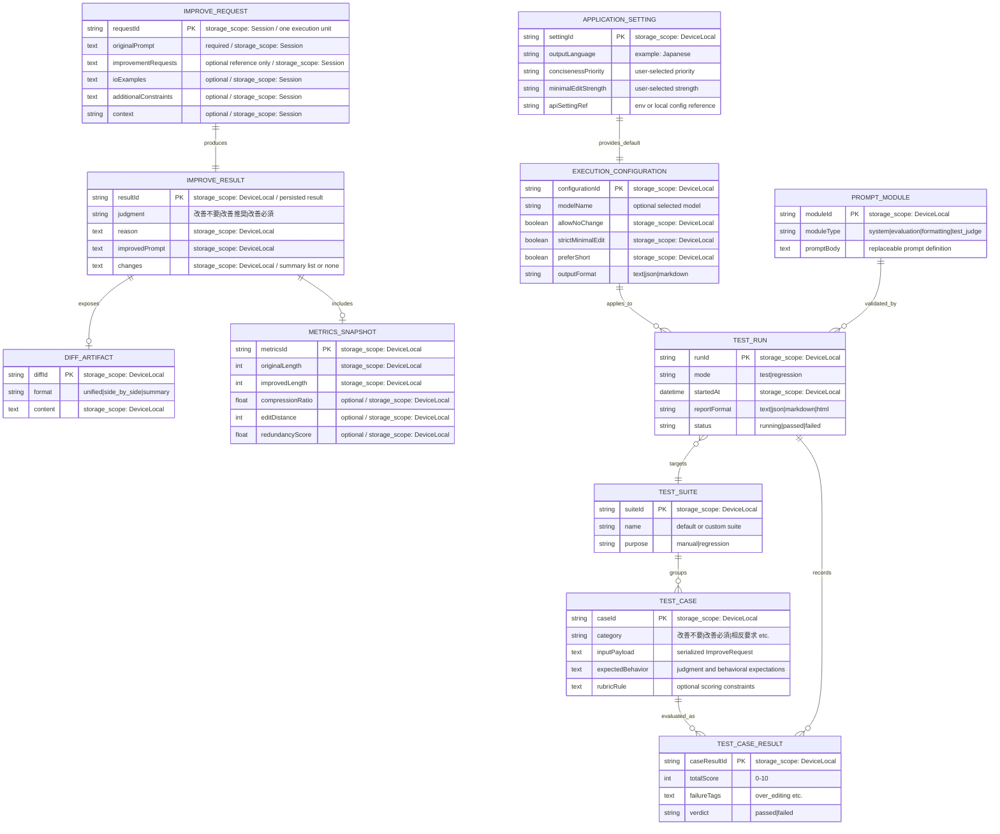

# DOMAIN_ER.md

- `IMPROVE_REQUEST` は単発実行の入力単位であり、必須入力は `originalPrompt` のみとする。
- `IMPROVE_RESULT` は判定と改善後プロンプトの一貫性を持つ成果物である。
- `TEST_CASE` は完全一致ではなく、期待挙動とルーブリック制約を保持する。
- `PROMPT_MODULE` は将来的な prompt definition 差し替えを可能にするための構成要素である。