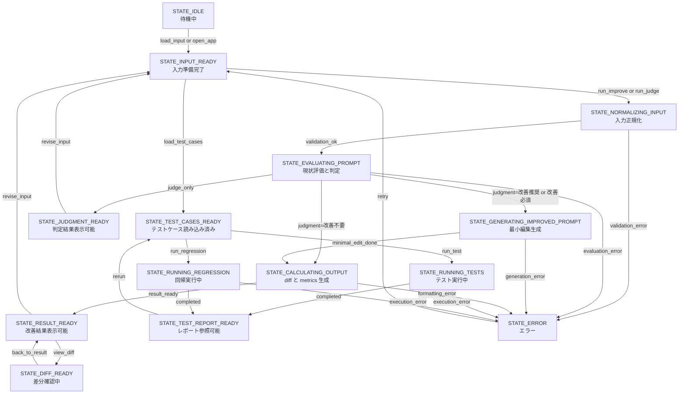

# INTERACTION_FLOW.md

```mermaid
flowchart TD
  STATE_IDLE["STATE_IDLE<br/>待機中"]
  STATE_INPUT_READY["STATE_INPUT_READY<br/>入力準備完了"]
  STATE_NORMALIZING_INPUT["STATE_NORMALIZING_INPUT<br/>入力正規化"]
  STATE_EVALUATING_PROMPT["STATE_EVALUATING_PROMPT<br/>現状評価と判定"]
  STATE_GENERATING_IMPROVED_PROMPT["STATE_GENERATING_IMPROVED_PROMPT<br/>最小編集生成"]
  STATE_CALCULATING_OUTPUT["STATE_CALCULATING_OUTPUT<br/>diff と metrics 生成"]
  STATE_JUDGMENT_READY["STATE_JUDGMENT_READY<br/>判定結果表示可能"]
  STATE_RESULT_READY["STATE_RESULT_READY<br/>改善結果表示可能"]
  STATE_DIFF_READY["STATE_DIFF_READY<br/>差分確認中"]
  STATE_TEST_CASES_READY["STATE_TEST_CASES_READY<br/>テストケース読み込み済み"]
  STATE_RUNNING_TESTS["STATE_RUNNING_TESTS<br/>テスト実行中"]
  STATE_RUNNING_REGRESSION["STATE_RUNNING_REGRESSION<br/>回帰実行中"]
  STATE_TEST_REPORT_READY["STATE_TEST_REPORT_READY<br/>レポート参照可能"]
  STATE_ERROR["STATE_ERROR<br/>エラー"]

  STATE_IDLE -->|load_input or open_app| STATE_INPUT_READY
  STATE_INPUT_READY -->|run_improve or run_judge| STATE_NORMALIZING_INPUT
  STATE_INPUT_READY -->|load_test_cases| STATE_TEST_CASES_READY

  STATE_NORMALIZING_INPUT -->|validation_ok| STATE_EVALUATING_PROMPT
  STATE_NORMALIZING_INPUT -->|validation_error| STATE_ERROR

  STATE_EVALUATING_PROMPT -->|judge_only| STATE_JUDGMENT_READY
  STATE_EVALUATING_PROMPT -->|judgment=改善不要| STATE_CALCULATING_OUTPUT
  STATE_EVALUATING_PROMPT -->|judgment=改善推奨 or 改善必須| STATE_GENERATING_IMPROVED_PROMPT
  STATE_EVALUATING_PROMPT -->|evaluation_error| STATE_ERROR

  STATE_GENERATING_IMPROVED_PROMPT -->|minimal_edit_done| STATE_CALCULATING_OUTPUT
  STATE_GENERATING_IMPROVED_PROMPT -->|generation_error| STATE_ERROR

  STATE_CALCULATING_OUTPUT -->|result_ready| STATE_RESULT_READY
  STATE_CALCULATING_OUTPUT -->|formatting_error| STATE_ERROR

  STATE_RESULT_READY -->|view_diff| STATE_DIFF_READY
  STATE_DIFF_READY -->|back_to_result| STATE_RESULT_READY
  STATE_JUDGMENT_READY -->|revise_input| STATE_INPUT_READY
  STATE_RESULT_READY -->|revise_input| STATE_INPUT_READY

  STATE_TEST_CASES_READY -->|run_test| STATE_RUNNING_TESTS
  STATE_TEST_CASES_READY -->|run_regression| STATE_RUNNING_REGRESSION
  STATE_RUNNING_TESTS -->|completed| STATE_TEST_REPORT_READY
  STATE_RUNNING_TESTS -->|execution_error| STATE_ERROR
  STATE_RUNNING_REGRESSION -->|completed| STATE_TEST_REPORT_READY
  STATE_RUNNING_REGRESSION -->|execution_error| STATE_ERROR

  STATE_TEST_REPORT_READY -->|rerun| STATE_TEST_CASES_READY
  STATE_ERROR -->|retry| STATE_INPUT_READY
```